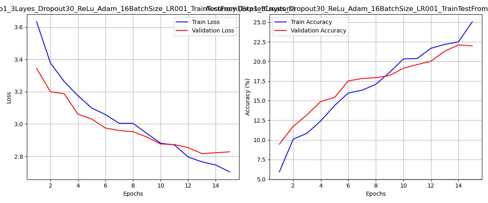
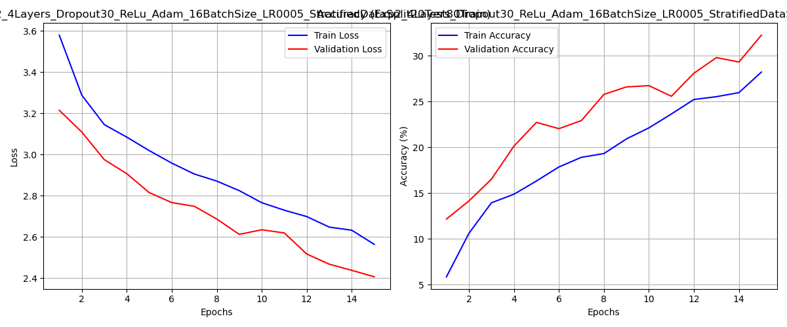
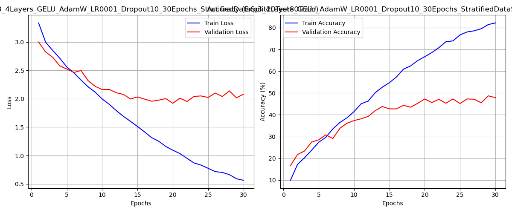
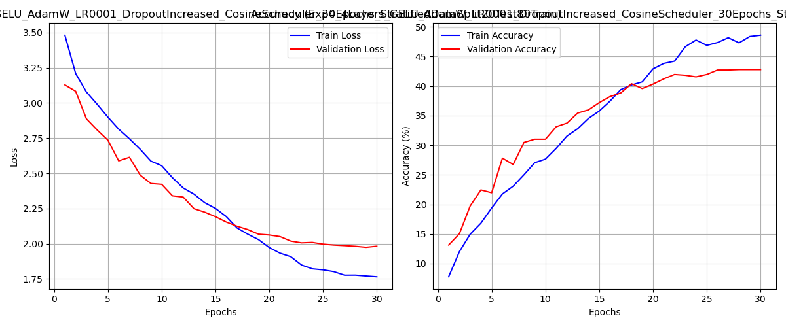

# CNN Pet Breed Classification — Oxford-IIIT Pet Dataset

A comparative study of custom Convolutional Neural Network architectures for fine-grained pet breed classification using the [Oxford-IIIT Pet Dataset](https://www.robots.ox.ac.uk/~vgg/data/pets/).

The dataset contains **7,349 images** across **37 pet breeds** (25 dog breeds + 12 cat breeds), with roughly 200 images per class.

---

## Project Structure

```
.
├── README.md
├── dataset.py
├── models
│   ├── Exp1_3Layes_Dropout30_ReLu_Adam_16BatchSize_LR001_TrainTestFromDatasetCreators.pth
│   ├── Exp2_4Layers_Dropout30_ReLu_Adam_16BatchSize_LR0005_StratifiedDataSplit20Test80Train.pth
│   ├── Exp3_4Layers_GELU_AdamW_LR0001_Dropout10_30Epochs_StratifiedDataSplit20Test80Train.pth
│   ├── Exp4_4Layers_GELU_AdamW_LR0001_DropoutIncreased_CosineScheduler_30Epochs_StratifiedDataSplit20Test80Train.pth
│   └── results
│       ├── Exp1_..._metrics.png
│       ├── Exp1_..._report.txt
│       ├── Exp2_..._metrics.png
│       ├── Exp2_..._report.txt
│       ├── Exp3_..._metrics.png
│       ├── Exp3_..._report.txt
│       ├── Exp4_..._metrics.png
│       └── Exp4_..._report.txt
├── train_exp1.py
├── train_exp2.py
├── train_exp3.py
├── train_exp4.py
└── utils.py
```

---

## Setup

```bash
pip install torch torchvision scikit-learn matplotlib pillow
```

Download the [Oxford-IIIT Pet Dataset](https://www.robots.ox.ac.uk/~vgg/data/pets/) and place `images/` and `annotations/` folders in the project root.

---

## Experiments Overview

### Architecture Configurations

| | Exp 1 | Exp 2 | Exp 3 | Exp 4 |
|---|---|---|---|---|
| **Conv layers** | 3 | 4 | 4 | 4 |
| **Activation** | ReLU | ReLU | GELU | GELU |
| **Optimizer** | Adam | Adam | AdamW | AdamW |
| **LR** | 0.001 | 0.0005 | 0.001 | 0.001 |
| **LR Scheduler** | — | — | — | CosineAnnealing |
| **Dropout (conv)** | 0.3 | 0.3 | 0.1 | 0.2 / 0.3 |
| **Dropout (FC)** | 0.5 | 0.5 | 0.3 | 0.5 |
| **Epochs** | 15 | 15 | 30 | 30 |
| **Data split** | Official split | Stratified 80/20 | Stratified 80/20 | Stratified 80/20 |
| **Augmentation** | Flip, Rotation | Flip, Rotation | Flip, Rotation | Flip, Rotation, RandomGrayscale |

---

## Results

### Summary Table

| Experiment | Val Accuracy | Macro F1 | Train Acc (last epoch) | Epochs |
|---|---|---|---|---|
| Exp 1 | 22% | 0.21 | 25% | 15 |
| Exp 2 | 32% | 0.30 | 28% | 15 |
| Exp 3 | **48%** | **0.48** | 82% | 30 |
| Exp 4 | 43% | 0.41 | 49% | 30 |

---

### Experiment 1 — Baseline
**3 conv layers · ReLU · Adam · LR 0.001 · 15 epochs · Official train/test split**

The baseline model uses the train/test split provided by the dataset authors. The official test set is significantly larger (~3,669 samples) and has a different class distribution than the training set, which makes evaluation harder and less representative. With only 3 convolutional layers, the model lacks sufficient capacity to learn fine-grained breed features.

- Val Accuracy: **22%** | Macro F1: **0.21**



---

### Experiment 2 — Deeper Network + Better Data Split
**4 conv layers · ReLU · Adam · LR 0.0005 · 15 epochs · Stratified 80/20 split**

**Changes vs Exp 1:** Added a 4th convolutional block (32→64→128→256 channels), switched to stratified 80/20 split to ensure balanced class distribution in both sets, and halved the LR to stabilize training with a deeper network.

The extra conv layer gave the model more representational capacity, and stratified splitting made the evaluation more fair and consistent. The result was a 10-point accuracy jump despite the same number of epochs.

- Val Accuracy: **32%** | Macro F1: **0.30**



---

### Experiment 3 — GELU + AdamW + More Epochs
**4 conv layers · GELU · AdamW · LR 0.001 · 30 epochs · Dropout 0.1/0.2**

**Changes vs Exp 2:** Replaced ReLU with GELU (smoother gradients, better suited for deeper networks), switched Adam to AdamW (adds decoupled weight decay, acts as an implicit regularizer), doubled training epochs to 30, and reduced conv dropout from 0.3 to 0.1 to allow the network to learn more freely.

The combination of GELU, AdamW, and more training time led to a substantial accuracy improvement. However, by epoch 30 the training accuracy reached 82% while val accuracy plateaued around 48%, indicating significant overfitting.

- Val Accuracy: **48%** | Macro F1: **0.48**



---

### Experiment 4 — Stronger Regularization + LR Scheduling
**4 conv layers · GELU · AdamW · LR 0.001 · 30 epochs · CosineAnnealing · Dropout 0.2/0.3/0.5**

**Changes vs Exp 3:** Increased dropout across all layers (conv: 0.1→0.2/0.3, FC: 0.3→0.5), added `CosineAnnealingLR` scheduler to gradually reduce the learning rate over training, and added `RandomGrayscale(p=0.05)` augmentation.

The heavy regularization effectively closed the train/val gap (train acc ~49% vs 82% in Exp 3), but the model was now underfitting — the regularization was too aggressive relative to the model's capacity, preventing it from learning complex breed features. Val accuracy dropped back to 43%.

- Val Accuracy: **43%** | Macro F1: **0.41**



---

## Conclusions

**Exp 3 achieved the best validation accuracy (48%)**, but shows clear overfitting (train 82% vs val 48%). **Exp 4** successfully reduced overfitting but overcorrected into underfitting territory — heavy dropout combined with cosine LR decay constrained the model too much.

Key takeaways from the experiments:

- **Data split matters more than expected.** Switching from the official split to stratified 80/20 (Exp 1→2) alone added +10% val accuracy.
- **GELU + AdamW is a strong combination** for this type of task — replacing ReLU+Adam with GELU+AdamW (Exp 2→3) added another +16%.
- **Regularization requires balance.** Exp 3 had too little (overfitting), Exp 4 had too much (underfitting). The optimal dropout values likely lie somewhere in between (e.g., conv 0.15, FC 0.4).
- **CosineAnnealingLR on its own** is a useful scheduler, but its benefit is diminished when combined with excessive dropout — the model never had a chance to converge to a good solution.

**Potential next steps** to push past 50% val accuracy without changing the overall architecture:
- Fine-tune dropout values between Exp 3 and Exp 4 levels
- Add `label_smoothing=0.1` to the cross-entropy loss
- Use `ReduceLROnPlateau` instead of fixed cosine schedule
- Apply stronger data augmentation (ColorJitter, RandomCrop)
- Add a second fully-connected layer before the output