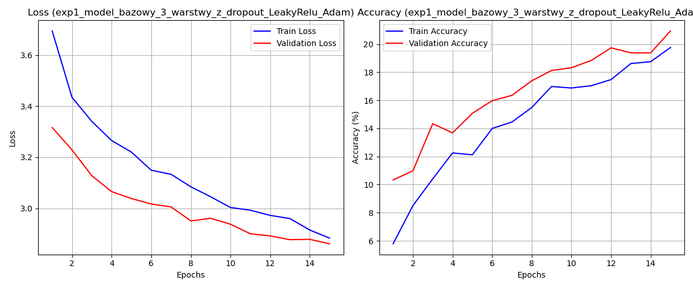
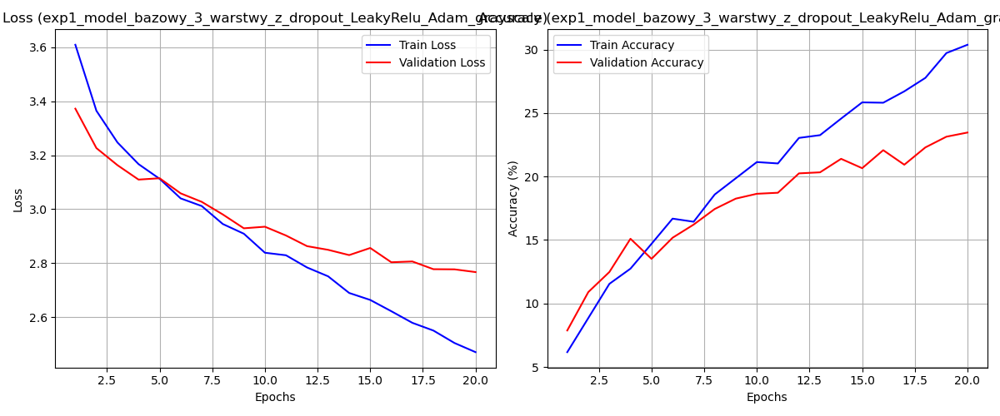
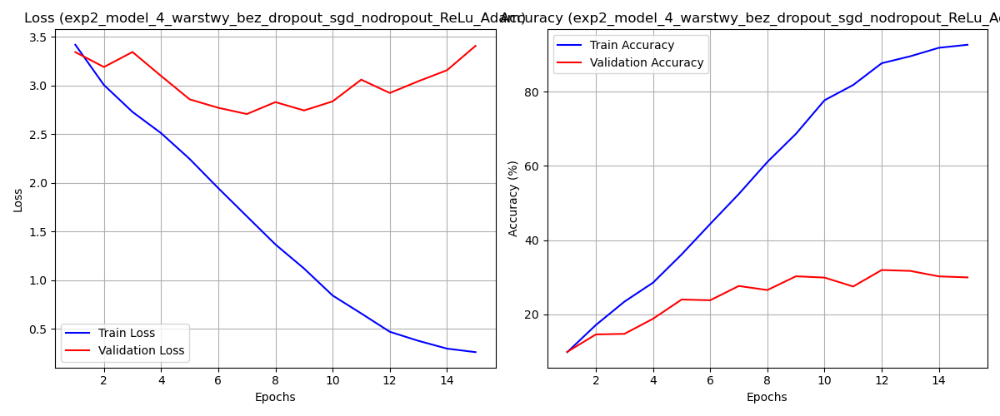
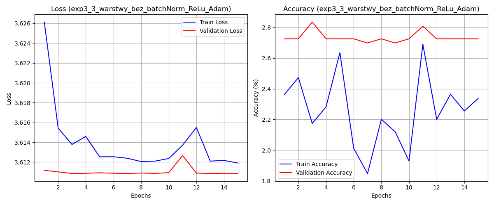

# 🐾 Pet Breed Classification with CNNs

A comparative study of custom Convolutional Neural Network architectures for fine-grained pet breed classification using the [Oxford-IIIT Pet Dataset](https://www.robots.ox.ac.uk/~vgg/data/pets/).

---

## 📋 Table of Contents

- [Dataset](#dataset)
- [Project Structure](#project-structure)
- [Experiments Overview](#experiments-overview)
- [Results](#results)
- [How to Run](#how-to-run)
- [Dependencies](#dependencies)

---

## 🗂 Dataset

The **Oxford-IIIT Pet Dataset** contains images of **37 breeds** of cats and dogs (classes `0–36`), with roughly 200 images per breed (~7,400 total). Each image is labeled with breed, head bounding box, and pixel-level segmentation mask.

- **Classes:** 37 (25 dog breeds + 12 cat breeds)
- **Test split used:** ~3,669 samples
- **Source:** https://www.robots.ox.ac.uk/~vgg/data/pets/

---

## 📁 Project Structure

```
.
├── README.md
├── dataset.py                  # Dataset loading and preprocessing
├── utils.py                    # Shared utilities (metrics, plotting, etc.)
├── train_exp1.py               # Training script – Experiment 1 (RGB)
├── train_exp1_grayscale.py     # Training script – Experiment 1 (Grayscale)
├── train_exp2.py               # Training script – Experiment 2
├── train_exp3.py               # Training script – Experiment 3
└── models/
    ├── exp1_model_bazowy_3_warstwy_z_dropout_LeakyRelu_Adam.pth
    ├── exp1_model_bazowy_3_warstwy_z_dropout_LeakyRelu_Adam_grayscale.pth
    ├── exp2_model_4_warstwy_bez_dropout_sgd_nodropout_ReLu_Adam.pth
    ├── exp3_3_warstwy_bez_batchNorm_ReLu_Adam.pth
    └── results/
        ├── exp1_model_bazowy_3_warstwy_z_dropout_LeakyRelu_Adam_grayscale_metrics.png
        ├── exp1_model_bazowy_3_warstwy_z_dropout_LeakyRelu_Adam_grayscale_report.txt
        ├── exp1_model_bazowy_3_warstwy_z_dropout_LeakyRelu_Adam_metrics.png
        ├── exp1_model_bazowy_3_warstwy_z_dropout_LeakyRelu_Adam_report.txt
        ├── exp2_model_4_warstwy_bez_dropout_sgd_nodropout_ReLu_Adam_metrics.png
        ├── exp2_model_4_warstwy_bez_dropout_sgd_nodropout_ReLu_Adam_report.txt
        ├── exp3_3_warstwy_bez_batchNorm_ReLu_Adam_metrics.png
        └── exp3_3_warstwy_bez_batchNorm_ReLu_Adam_report.txt
```

---

## 🔬 Experiments Overview

Four CNN configurations were trained and evaluated. All models use the **Adam optimizer** unless otherwise noted and are trained on 37-class classification.

| # | Experiment | Layers | Activation | Regularization | Input | Optimizer |
|---|-----------|--------|------------|----------------|-------|-----------|
| Exp 1 (RGB) | Baseline 3-layer + Dropout | 3 conv | LeakyReLU | Dropout | RGB | Adam |
| Exp 1 (Grayscale) | Baseline 3-layer + Dropout (grayscale) | 3 conv | LeakyReLU | Dropout | Grayscale | Adam |
| Exp 2 | 4-layer, no Dropout | 4 conv | ReLU | None | RGB | Adam |
| Exp 3 | 3-layer + BatchNorm, no Dropout | 3 conv | ReLU | BatchNorm | RGB | Adam |

### Exp 1 — Baseline 3-Layer CNN with Dropout + LeakyReLU (RGB)
- 3 convolutional layers with **LeakyReLU** activations
- **Dropout** for regularization
- Trained on standard **RGB** images
- Training script: `train_exp1.py`

### Exp 1 (Grayscale) — Baseline 3-Layer CNN with Dropout + LeakyReLU (Grayscale)
- Same architecture as Exp 1 RGB
- Input converted to **grayscale** (1 channel) — investigates the impact of color information on performance
- Training script: `train_exp1_grayscale.py`

### Exp 2 — 4-Layer CNN, No Dropout, ReLU
- **4 convolutional layers** for increased representational capacity
- Standard **ReLU** activations
- **No Dropout** — tests the effect of removing explicit regularization when depth is added
- Training script: `train_exp2.py`

### Exp 3 — 3-Layer CNN with BatchNorm, No Dropout
- 3 convolutional layers with **ReLU** activations
- **Batch Normalization** instead of Dropout
- Serves as an ablation to test BatchNorm-only stabilization without any dropout regularization
- Training script: `train_exp3.py`

---

## 📊 Results

### Summary Table

| Experiment                      | Accuracy | Macro Avg Precision | Macro Avg Recall | Macro Avg F1 |
|---------------------------------|:--------:|:-------------------:|:----------------:|:------------:|
| Exp 1 – RGB                     | 0.21 | 0.21 | 0.21 | 0.19 |
| Exp 1 – Grayscale               | 0.23 | 0.23 | 0.24 | 0.22 |
| **Exp 2 – 4-layer, no Dropout** | **0.30** | **0.35** | **0.30** | **0.30** |
| Exp 3 – Without BatchNorm       | 0.03 | 0.00 | 0.03 | 0.00 |

---

### Training Curves

Training and validation loss/accuracy plots for each experiment are saved in `models/results/`:

| Experiment                | Metrics Plot |
|---------------------------|-------------|
| Exp 1 – RGB               |  |
| Exp 1 – Grayscale         |  |
| Exp 2 – 4-layer           |  |
| Exp 3 – Without BatchNorm |  |

---

### Analysis

**Exp 2** achieved the best overall performance with **30% accuracy** and a macro F1 of 0.30. The additional convolutional layer provided greater representational capacity, and removing Dropout did not lead to meaningful overfitting within the training budget. Some individual classes were particularly well-distinguished — for example, class `11` reached precision 0.67 and class `19` reached precision 0.76.

**Exp 1 (Grayscale)** slightly outperformed its RGB counterpart on raw accuracy (23% vs 21%). This suggests that for this architecture and training duration, the additional complexity of processing 3-channel input did not translate into a clear benefit — color cues alone are not sufficient to overcome the model's limited capacity.

**Exp 1 (RGB)** is a stable but limited baseline. Dropout provides regularization, but may over-constrain the model's capacity when dealing with a challenging 37-class fine-grained problem.

**Exp 3** collapsed entirely — all predictions were assigned to a single class (`35`), resulting in near-zero performance across all other classes (accuracy 0.03, macro F1 ≈ 0.00). This indicates **training instability or mode collapse**, likely caused by the combination of Batch Normalization without complementary regularization and a suboptimal learning rate or weight initialization. This experiment highlights the importance of careful hyperparameter tuning when substituting BatchNorm for Dropout.

---

## ▶️ How to Run

### 1. Install dependencies

```bash
pip install -r requirements.txt
```

### 2. Download and prepare the dataset

```bash
python dataset.py
```

This will download the Oxford-IIIT Pet Dataset and set up the required directory structure.

### 3. Train a model

```bash
# Experiment 1 – RGB baseline
python train_exp1.py

# Experiment 1 – Grayscale variant
python train_exp1_grayscale.py

# Experiment 2 – 4-layer CNN
python train_exp2.py

# Experiment 3 – BatchNorm variant
python train_exp3.py
```

Trained model weights are saved to `models/` and evaluation reports + plots to `models/results/`.

---

## 📦 Dependencies

- Python 3.8+
- PyTorch
- torchvision
- scikit-learn
- matplotlib
- numpy

---

## 📌 Key Takeaways

- **Depth matters** — increasing from 3 to 4 convolutional layers (Exp 2) yielded the most significant accuracy gain (+9 pp over the RGB baseline).
- **Color information** had a surprisingly small effect at this model scale — grayscale performed comparably or slightly better than RGB for the same architecture.
- **Batch Normalization alone** (without Dropout or other stabilization) led to complete model failure in this setting, underlining the sensitivity of training dynamics to architectural and hyperparameter choices.
- All models remain well below state-of-the-art performance on this dataset. The most impactful next step would be adopting **transfer learning** from a pre-trained backbone (e.g., ResNet-50, EfficientNet) to leverage rich ImageNet representations rather than learning from scratch.